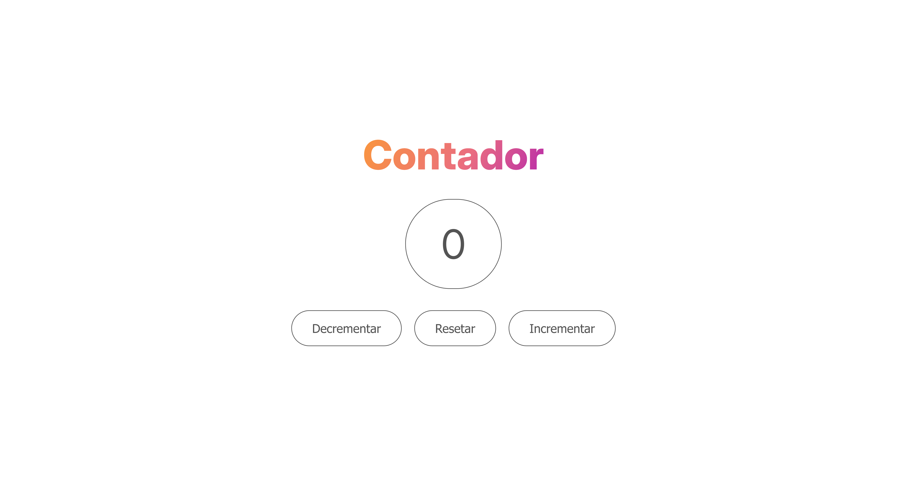

<h1 align="center">
  Contador
</h1>

<p align="center">
  
  
  
  
  
</p>

<p align="center">
  
</p>

## 💻 Projeto

Este é um contador online, a aplicação permite incrementar o valor do contador, resetar e decrementar quando o valor do contador for maior que zero.

## 🛠️ Tecnologias

-  [HTML5](https://angular.io/)
-  [CSS3](https://material.angular.io/)
-  [Javascript](https://www.typescriptlang.org/)


## 🚀 Instalação e execução

Execute o comando abaixo no seu terminal para clonar o repositório e abra o projeto em um editor de código.

```bash
# Clonando o repositório
$ git clone https://github.com/Kaua-Cavalcante/Contador.git
```